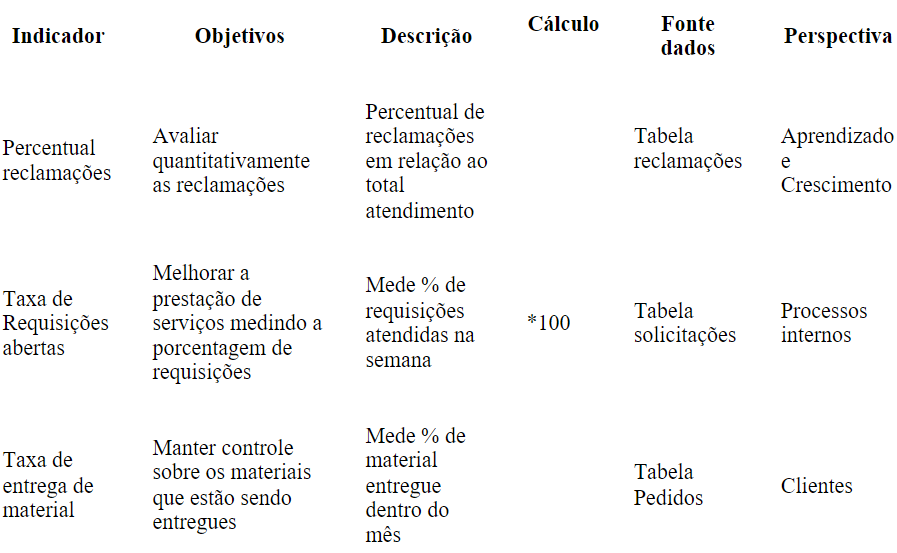

# Especificações do Projeto

Pré-requisitos: <a href="1-Documentação de Contexto.md"> Documentação de Contexto</a>

Definição do problema e ideia de solução a partir da perspectiva do usuário. É composta pela definição do  diagrama de personas, histórias de usuários, requisitos funcionais e não funcionais além das restrições do projeto.

Apresente uma visão geral do que será abordado nesta parte do documento, enumerando as técnicas e/ou ferramentas utilizadas para realizar a especificações do projeto

## Personas

## Personas

As personas levantadas durante o processo de entendimento do problema são apresentadas na Figuras que se seguem.

## Histórias de Usuários

Com base na análise das personas forma identificadas as seguintes histórias de usuários:

EU COMO... `PERSONA`| QUERO/PRECISO ... `FUNCIONALIDADE` |PARA ... `MOTIVO/VALOR`                 |
|--------------------|------------------------------------|----------------------------------------|
|Genivaldo Alves | Ter uma ferramenta fácil de acessar e segura       | Para que possa contratar o serviço e ficar tranquilo em seu trabalho .          |
|Marta Helena | Ter profissionais qualificados.       | Se sentir segura em contratar o serviço.           |
|Antonella Soares |Ter um trabalho de algo que ela goste e possa conciliar com seus estudos.           | para que ela administre seu horário de trabalho..  

stakes/)

## Modelagem do Processo de Negócio 

### Análise da Situação Atual

Tão importante quanto a alimentação, passear com o cachorro todos os dias traz diversos benefícios para a saúde física e mental do animal.
Além de ele fazer atividade física, prevenindo diversas doenças como obesidade, é durante a caminhada que o cão alivia o estresse e a energia acumulada. 
Durante o passeio, ele também faz a socialização com outros animais e pessoas, colocando seu instinto em prática. 

### Descrição Geral da Proposta

Apresente aqui uma descrição da sua proposta abordando seus limites e suas ligações com as estratégias e objetivos do negócio. Apresente aqui as oportunidades de melhorias.

### Processo 1 – NOME DO PROCESSO

Apresente aqui o nome e as oportunidades de melhorias para o processo 1. Em seguida, apresente o modelo do processo 1, descrito no padrão BPMN. 

### Processo 2 – NOME DO PROCESSO

Apresente aqui o nome e as oportunidades de melhorias para o processo 2. Em seguida, apresente o modelo do processo 2, descrito no padrão BPMN.

## Indicadores de Desempenho

Apresente aqui os principais indicadores de desempenho e algumas metas para o processo. Atenção: as informações necessárias para gerar os indicadores devem estar contempladas no diagrama de classe. Colocar no mínimo 5 indicadores. 

Usar o seguinte modelo: 

Obs.: todas as informações para gerar os indicadores devem estar no diagrama de classe a ser apresentado a posteriori. 

## Requisitos

O escopo funcional do projeto é definido por meio dos requisitos funcionais que descrevem as possibilidades interação dos usuários, bem como os requisitos não funcionais descrevem os aspectos que o sistema deverá apresentar de maneira geral. Estes requisitos são apresentados a seguir.

### Requisitos Funcionais

|ID    | Descrição do Requisito  | Prioridade |
|------|-----------------------------------------|----|
|RF-001|A aplicação deve permitir ao usuário (Tutor e passeador) cadastrar uma conta | ALTA | 
RF-002|A aplicação deve permitir ao usuário (Tutor e passeador) fazer o login de sua conta.| ALTA | 
RF-003|A aplicação deve permitir ao usuário (Tutor e passeador) disponibilizar informações sobre endereço e contato.| ALTA | 
RF-004|A aplicação deve permitir ao Tutor ter acesso às informações do Passeador.| ALTA | 
RF-005|A A aplicação deve oferecer uma funcionalidade de pesquisa/filtro para permitir ao Tutor localizar o passeador próximo a sua localidade. | ALTA | 
RF-006|A aplicação deve apresentar o perfil do Passeador com imagem e informações.| ALTA | 
RF-007|A aplicação deve permitir que o Tutor faça o pagamento somente pelo app ou pix| ALTA | 
RF-008|A aplicação deve permitir ao Tutor fazer agendamentos.| ALTA | 
RF-009A aplicação deve permitir ao Tutor gerenciar seus agendamentos. | ALTA | 
RF-010|A aplicação deve permitir ao Passeador visualizar sua agenda.| ALTA | 
RF-011|A aplicação deve permitir ao Passeador aceitar ou negar agendamentos | ALTA |
RF-012|A aplicação deve permitir ao Passeador visualizar seu faturamento. | ALTA |
RF-013|A aplicação deverá permitir que as solicitações sejam ordenadas por ordem de chegada | ALTA |

### Requisitos não Funcionais

|ID     | Descrição do Requisito  |Prioridade |
|-------|-------------------------|----|
|RNF-001| O site deve ser publicado em um ambiente acessível publicamente na Internet (Repl.it, GitHub Pages, Heroku);  | MÉDIA | 
|RNF-002| Deve processar requisições do usuário em no máximo 3s |  BAIXA
RNF-003| O site deverá ser responsivo permitindo a visualização em um celular de forma adequada. |  BAIXA 
RNF-004| O site deve ter bom nível de contraste entre os elementos da tela em conformidade. |  BAIXA 
RNF-005| O site deve ser compatível com os principais navegadores do mercado (Google Chrome, Firefox, Microsoft Edge) |  BAIXA  | 

## Restrições

As questões que limitam a execução desse projeto e que se configuram como obrigações claras para o desenvolvimento do projeto em questão são apresentadas na tabela a seguir.

|ID| Restrição                                             |
|--|-------------------------------------------------------|
|01| O projeto deverá ser entregue no final do semestre letivo, não podendo advir a data de 01/12/2023. |
|02| O aplicativo não deve se restringir às tecnologias básicas da Web no BackEnd        |
|03| A equipe não pode subcontratar o desenvolvimento do trabalho.  

## Diagrama de Casos de Uso

O diagrama de casos de uso é o próximo passo após a elicitação de requisitos, que utiliza um modelo gráfico e uma tabela com as descrições sucintas dos casos de uso e dos atores. Ele contempla a fronteira do sistema e o detalhamento dos requisitos funcionais com a indicação dos atores, casos de uso e seus relacionamentos. 

# Matriz de Rastreabilidade

A matriz de rastreabilidade é uma ferramenta usada para facilitar a visualização dos relacionamento entre requisitos e outros artefatos ou objetos, permitindo a rastreabilidade entre os requisitos e os objetivos de negócio. 

A matriz deve contemplar todos os elementos relevantes que fazem parte do sistema, conforme a figura meramente ilustrativa apresentada a seguir.

> **Links Úteis**:
> - [Artigo Engenharia de Software 13 - Rastreabilidade](https://www.devmedia.com.br/artigo-engenharia-de-software-13-rastreabilidade/12822/)
> - [Verificação da rastreabilidade de requisitos usando a integração do IBM Rational RequisitePro e do IBM ClearQuest Test Manager](https://developer.ibm.com/br/tutorials/requirementstraceabilityverificationusingrrpandcctm/)
> - [IBM Engineering Lifecycle Optimization – Publishing](https://www.ibm.com/br-pt/products/engineering-lifecycle-optimization/publishing/)

# Gerenciamento de Projeto

De acordo com o PMBoK v6 as dez áreas que constituem os pilares para gerenciar projetos, e que caracterizam a multidisciplinaridade envolvida, são: Integração, Escopo, Cronograma (Tempo), Custos, Qualidade, Recursos, Comunicações, Riscos, Aquisições, Partes Interessadas. Para desenvolver projetos um profissional deve se preocupar em gerenciar todas essas dez áreas. Elas se complementam e se relacionam, de tal forma que não se deve apenas examinar uma área de forma estanque. É preciso considerar, por exemplo, que as áreas de Escopo, Cronograma e Custos estão muito relacionadas. Assim, se eu amplio o escopo de um projeto eu posso afetar seu cronograma e seus custos.

## Gerenciamento de Tempo

Com diagramas bem organizados que permitem gerenciar o tempo nos projetos, o gerente de projetos agenda e coordena tarefas dentro de um projeto para estimar o tempo necessário de conclusão.

O gráfico de Gantt ou diagrama de Gantt também é uma ferramenta visual utilizada para controlar e gerenciar o cronograma de atividades de um projeto. Com ele, é possível listar tudo que precisa ser feito para colocar o projeto em prática, dividir em atividades e estimar o tempo necessário para executá-las.

## Gerenciamento de Equipe

O gerenciamento adequado de tarefas contribuirá para que o projeto alcance altos níveis de produtividade. Por isso, é fundamental que ocorra a gestão de tarefas e de pessoas, de modo que os times envolvidos no projeto possam ser facilmente gerenciados. 

## Gestão de Orçamento

O processo de determinar o orçamento do projeto é uma tarefa que depende, além dos produtos (saídas) dos processos anteriores do gerenciamento de custos, também de produtos oferecidos por outros processos de gerenciamento, como o escopo e o tempo.

