# Especificações do Projeto

Pré-requisitos: <a href="01-Documentação de Contexto.md"> Documentação de Contexto</a>

Nesta seção do documento, serão abordadas as especificações do projeto, fornecendo uma visão detalhada dos pré-requisitos, definição do problema, ideia de solução, [diagrama de personas](#personas), [histórias de usuários](#histórias-de-usuários), [requisitos funcionais](#requisitos-funcionais) e [não funcionais](#requisitos-não-funcionais), bem como as [restrições do projeto](#restrições). Para isso, serão utilizadas técnicas como entrevistas com stakeholders, análise de documentos de contexto, brainstorming e ferramentas de documentação de requisitos.

A seguir, será apresentado o resultado da análise e definição do problema, bem como uma proposta de solução a partir da perspectiva do usuário, alinhando as necessidades identificadas com os objetivos do projeto. O [diagrama de personas](#personas) será criado para representar os principais perfis de usuários envolvidos, enquanto as [histórias de usuários](#histórias-de-usuários) detalharão os requisitos de forma mais granular. Por fim, os [requisitos funcionais](#requisitos-funcionais) e [não funcionais](#requisitos-não-funcionais) serão identificados e documentados, juntamente com quaisquer restrições importantes para o projeto.

Este processo garantirá uma compreensão abrangente dos objetivos e requisitos do projeto, orientando o desenvolvimento da solução de forma eficaz e alinhada com as necessidades dos usuários e as diretrizes do projeto.

## Personas

As personas levantadas durante o processo de entendimento do problema são apresentadas na Figuras que se seguem.

## Histórias de Usuários

Com base na análise das personas forma identificadas as seguintes histórias de usuários:

| EU COMO... `PERSONA` | QUERO/PRECISO ... `FUNCIONALIDADE`                                        | PARA ... `MOTIVO/VALOR`                                               |
|----------------------|---------------------------------------------------------------------------|-----------------------------------------------------------------------|
| Genivaldo Alves      | Ter uma ferramenta fácil de acessar e segura                              | Para que possa contratar o serviço e ficar tranquilo em seu trabalho. |
| Marta Helena         | Ter profissionais qualificados.                                           | Se sentir segura em contratar o serviço.                              |
| Antonella Soares     | Ter um trabalho de algo que ela goste e possa conciliar com seus estudos. | para que ela administre seu horário de trabalho                       |

## Modelagem do Processo de Negócio 

### Análise da Situação Atual

Tão importante quanto a alimentação, passear com o cachorro todos os dias traz diversos benefícios para a saúde física e mental do animal.
Além de ele fazer atividade física, prevenindo diversas doenças como obesidade, é durante a caminhada que o cão alivia o estresse e a energia acumulada. 
Durante o passeio, ele também faz a socialização com outros animais e pessoas, colocando seu instinto em prática. 

### Descrição Geral da Proposta

Os processos de negócio são realizados por meio de um aplicativo, que é acessado tanto pelo tutor quanto pelo profissional. O aplicativo é responsável por intermediar o contato entre os dois, permitindo que o tutor encontre um profissional, faça o agendamento e pague pelo serviço, e que o profissional aceite ou recuse o agendamento, realize o treinamento e registre a conclusão do serviço.

### Overview do Processo

O processo de negócio é composto por dois processos principais: **agendamento do treinamento** e **realização do treinamento**. Além desses, há um processo de **cadastro de profissionais/cliente**, um **processo de cadastro de Pets** e **um processo de pagamento**. Como podemos ver no diagrama de processos a seguir.

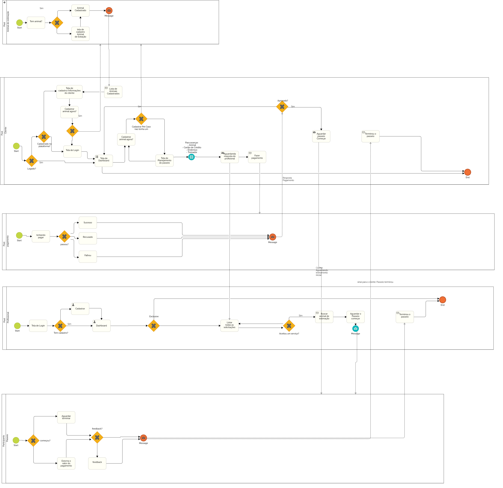

### Processo 1 – Agendamento do Treinamento

Neste processo, o tutor do pet tem a oportunidade de agendar um treinamento com um profissional. O tutor acessa o aplicativo, procura por profissionais disponíveis, escolhe um de acordo com suas preferências e faz o agendamento. O profissional recebe uma notificação sobre o novo agendamento e pode aceitá-lo ou recusá-lo.

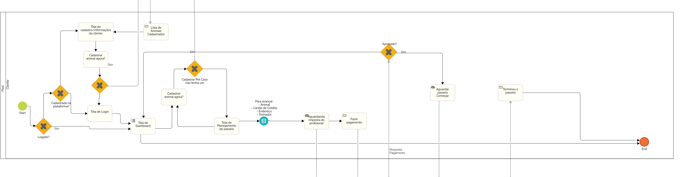

### Processo 2 – Realização do Treinamento

Após o agendamento ser aceito pelo profissional, o treinamento é realizado. O profissional vai até o local indicado pelo tutor, realiza o treinamento com o pet e, em seguida, registra no aplicativo que o treinamento foi concluído. O tutor recebe uma notificação sobre a conclusão do treinamento e pode avaliar o profissional.

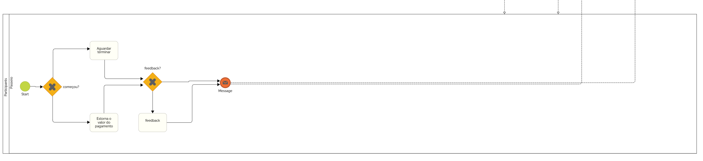

### Processo 3 – Cadastro de Clientes e Profissionais

O __tutor__ interessado em contratar um profissional para treinar seu pet se cadastra no aplicativo, informando seus dados pessoais, de contato e de pagamento. O cadastro é analisado e, se aprovado, o tutor passa a fazer parte do banco de dados do aplicativo.

O __profissional__ interessado em prestar serviços de treinamento de pets se cadastra no aplicativo, informando seus dados pessoais, profissionais e bancários. O cadastro é analisado e, se aprovado, o profissional passa a fazer parte do banco de dados do aplicativo.

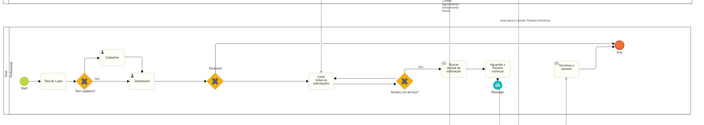

### Processo 4 – Cadastro de Pets

O tutor do pet cadastra o animal no aplicativo, informando seus dados pessoais e de saúde. O cadastro é aprovado e o pet passa a fazer parte do banco de dados do aplicativo.

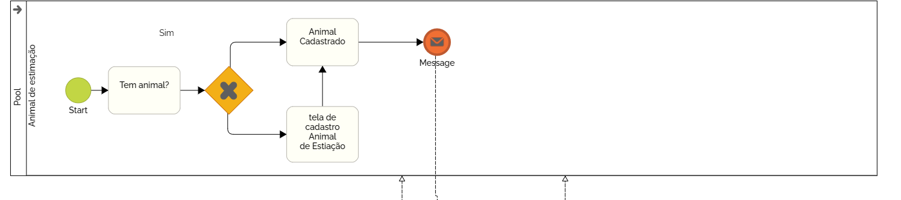

### Processo 5 – Pagamento

Após a conclusão do treinamento, o tutor paga pelo serviço. O pagamento é feito pelo aplicativo, que repassa o valor ao profissional.

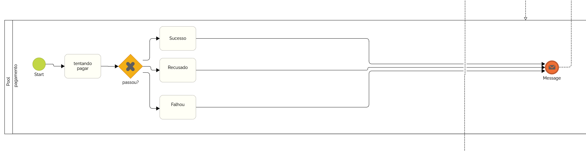

## Indicadores de Desempenho

Apresente aqui os principais indicadores de desempenho e algumas metas para o processo. Atenção: as informações necessárias para gerar os indicadores devem estar contempladas no diagrama de classe. Colocar no mínimo 5 indicadores. 

Usar o seguinte modelo: 

| Indicador de Desempenho          | Fórmula                                                                       | Meta                                                |
|----------------------------------|-------------------------------------------------------------------------------|-----------------------------------------------------|
| Número de agendamentos           | Número de agendamentos com status "Concluído" / Número total de agendamentos. | 100 agendamentos por mês.                           |
| Número de passeios concluídos    | Quantidade de passeios concluídos.                                            | Atingir 90% de passeios concluídos no período.      |
| Tempo Médio de Atendimento       | Tempo total de atendimento / Número de agendamentos.                          | Reduzir o tempo médio de atendimento para 24 horas. |
| Número de Passeios por Passeador | Quantidade média de passeios realizados por cada passeador no período.        | Mais de 7 passeios por dia, em média.               |
| Faturamento mensal               | Valor total dos treinamentos realizados.                                      | R$ 10.000,00.                                       |

>Obs.: todas as informações para gerar os indicadores devem estar no diagrama de classe a ser apresentado a posteriori. 

## Requisitos

O escopo funcional do projeto é definido por meio dos [requisitos funcionais](#requisitos-funcionais) que descrevem as possibilidades interação dos usuários, bem como os requisitos [não funcionais](#requisitos-não-funcionais) descrevem os aspectos que o sistema deverá apresentar de maneira geral. Estes requisitos são apresentados a seguir.

### Requisitos Funcionais

| ID     | Descrição do Requisito                                                                                                | Prioridade |
|--------|-----------------------------------------------------------------------------------------------------------------------|------------|
| RF-001 | Permitir ao usuário (Tutor e passeador) cadastrar uma conta.                                                          | ALTA       |
| RF-002 | Permitir ao usuário (Tutor e passeador) fazer o login de sua conta.                                                   | ALTA       |
| RF-003 | Permitir ao usuário (Tutor e passeador) disponibilizar informações sobre endereço e contato.                          | ALTA       |
| RF-004 | Permitir ao Tutor ter acesso às informações do Passeador.                                                             | ALTA       |
| RF-005 | Oferecer uma funcionalidade de pesquisa/filtro para permitir ao Tutor localizar o passeador próximo a sua localidade. | ALTA       |
| RF-006 | A aplicação deve apresentar o perfil do Passeador com imagem e informações.                                           | ALTA       |
| RF-007 | A aplicação deve permitir que o Tutor faça o pagamento somente pelo app ou pix                                        | ALTA       |
| RF-008 | A aplicação deve permitir ao Tutor fazer agendamentos.                                                                | ALTA       |
| RF-009 | A aplicação deve permitir ao Tutor gerenciar seus agendamentos.                                                       | ALTA       |
| RF-010 | A aplicação deve permitir ao Passeador visualizar sua agenda.                                                         | ALTA       |
| RF-011 | A aplicação deve permitir ao Passeador aceitar ou negar agendamentos                                                  | ALTA       |
| RF-012 | A aplicação deve permitir ao Passeador visualizar seu faturamento.                                                    | ALTA       |
| RF-013 | A aplicação deverá permitir que as solicitações sejam ordenadas por ordem de chegada                                  | ALTA       |

### Requisitos não Funcionais

A seguir, são apresentados os requisitos não funcionais identificados para o projeto:

| ID      | Descrição do Requisito                                                                                        | Prioridade |
|---------|---------------------------------------------------------------------------------------------------------------|------------|
| RNF-001 | O site deve ser publicado em um ambiente acessível publicamente na Internet (Repl.it, GitHub Pages, Heroku).  | MÉDIA      |
| RNF-002 | O sistema deve processar requisições do usuário em no máximo 3 segundos.                                      | BAIXA      |
| RNF-003 | O site deve ser responsivo, permitindo uma visualização adequada em dispositivos móveis.                      | BAIXA      |
| RNF-004 | O site deve apresentar bom nível de contraste entre os elementos da tela, seguindo padrões de acessibilidade. | BAIXA      |
| RNF-005 | O site deve ser compatível com os principais navegadores do mercado (Google Chrome, Firefox, Microsoft Edge). | BAIXA      |

## Restrições

As restrições que moldam a execução deste projeto e estabelecem obrigações claras para o seu desenvolvimento são apresentadas na tabela abaixo:

| ID | Restrição                                                                        |
|----|----------------------------------------------------------------------------------|
| 01 | O projeto deve ser entregue até o final do semestre letivo, sem exceder 07/2024. |
| 02 | O aplicativo não deve se limitar às tecnologias básicas da Web no BackEnd.       |
| 03 | A equipe não está autorizada a terceirizar o desenvolvimento do projeto.         |

## Diagrama de Casos de Uso

O Diagrama de Casos de Uso apresentado abaixo ilustra as interações entre os usuários e o sistema em diferentes cenários de uso. Os atores envolvidos são o Tutor e o Passeador, que interagem com o sistema por meio de diferentes funcionalidades, como cadastro, login, pesquisa, agendamento e pagamento.

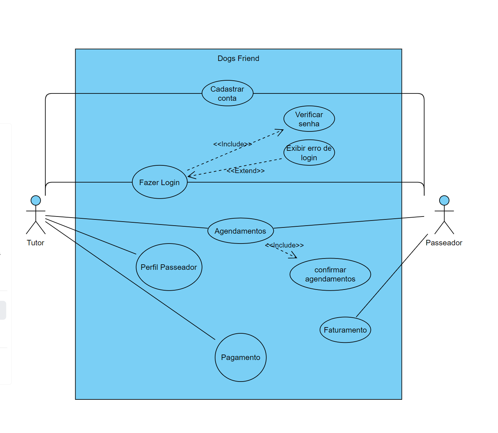

# Matriz de Rastreabilidade

A Matriz de Rastreabilidade de Requisitos é uma ferramenta essencial no desenvolvimento de projetos, garantindo a coesão entre os requisitos e as soluções implementadas. Na planilha apresentada abaixo, destaca-se a interligação entre os  [requisitos funcionais](#requisitos-funcionais) e [não funcionais](#requisitos-não-funcionais). Ao mapear essas conexões, obtém-se clareza sobre as dependências e os impactos, garantindo que o projeto atenda consistentemente às demandas estabelecidas.

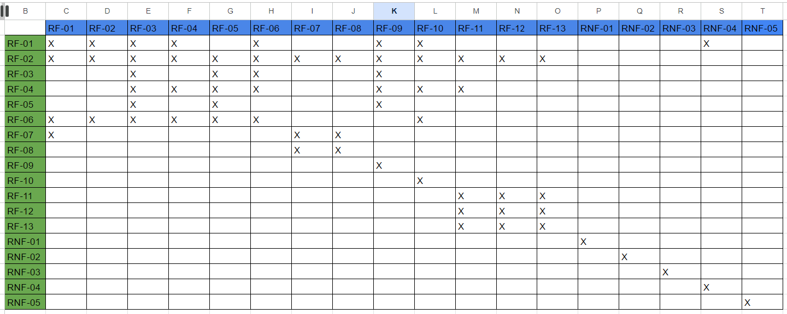

# Gerenciamento de Projeto
 
Segundo Vargas (2018), _um projeto é um empreendimento único, caracterizado por uma sequência lógica de eventos, com começo, meio e fim, visando alcançar um objetivo claro e definido, sendo conduzido por pessoas dentro de parâmetros predefinidos de tempo, custo, recursos envolvidos e qualidade_. Com base nessa definição, desenvolvemos a documentação e o aplicativo AutoApp, utilizando também os princípios descritos no PMBoK.

De acordo com a sexta edição do PMBoK, as dez áreas que compõem os pilares para gerenciar projetos são: Integração, Escopo, Cronograma (Tempo), Custos, Qualidade, Recursos, Comunicações, Riscos, Aquisições e Partes Interessadas. Para o desenvolvimento eficaz de um projeto, é essencial gerenciar todas essas áreas de forma integrada, considerando suas inter-relações. Por exemplo, alterações no escopo podem impactar diretamente o cronograma e os custos do projeto.

Antes do início do projeto, é crucial avaliá-lo sob uma perspectiva financeira. Existem várias técnicas que podem ser empregadas para isso, como o valor presente líquido, taxa interna de retorno, análise de custo-benefício, payback ou cost of delay. Além disso, ter uma visão clara do produto é fundamental para orientar o início e o término do projeto.

## Divisão de Papéis

A equipe adota métodos ágeis, utilizando o Scrum como base do processo de desenvolvimento. A estrutura organizacional é definida da seguinte maneira:

- __Product Owner (P.O.)__: Jeosafa Boy Eller;
- __Scrum Master__: Ronald Justiniano Costa;
- __Equipe de Desenvolvimento__: Taciana Emanuela Campos Vitorino, Ronald Justiniano Costa, Jeosafa Boy Eller, Gabriel;
- __Equipe de Design__: Felipe Corrêa Carneiro, Taciana Emanuela Campos Vitorino.

O trabalho é dividido em tarefas, com reuniões semanais após encontros com o P.O. para planejamento e esclarecimento de dúvidas. Na primeira reunião de cada etapa, as tarefas são organizadas e distribuídas. Na segunda-feira que antecede a entrega da etapa, a equipe se reúne para revisar e alinhar o que foi realizado. A Scrum Master acompanha essas tarefas semanalmente, seguindo o fluxo de metodologia descrito na imagem abaixo:

## Gerenciamento de Tempo

O cronograma do projeto é fundamental para garantir que as atividades sejam concluídas dentro do prazo estabelecido, conforme destacado por Vargas (2018). O gerenciamento do cronograma envolve a coordenação e o acompanhamento das tarefas ao longo do tempo, permitindo uma estimativa precisa do tempo necessário para a conclusão de cada atividade.

O uso de diagramas bem estruturados é essencial para esse gerenciamento, fornecendo uma visão clara e organizada das atividades do projeto, como exemplificado na imagem abaixo:

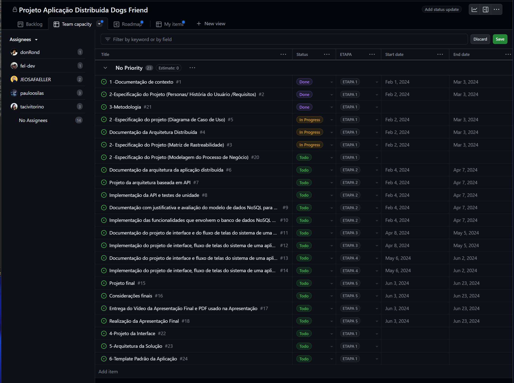

O gráfico de Gantt, também conhecido como diagrama de Gantt, é uma ferramenta visual amplamente utilizada para controlar e gerenciar o cronograma de atividades de um projeto, conforme demonstrado na imagem a seguir:

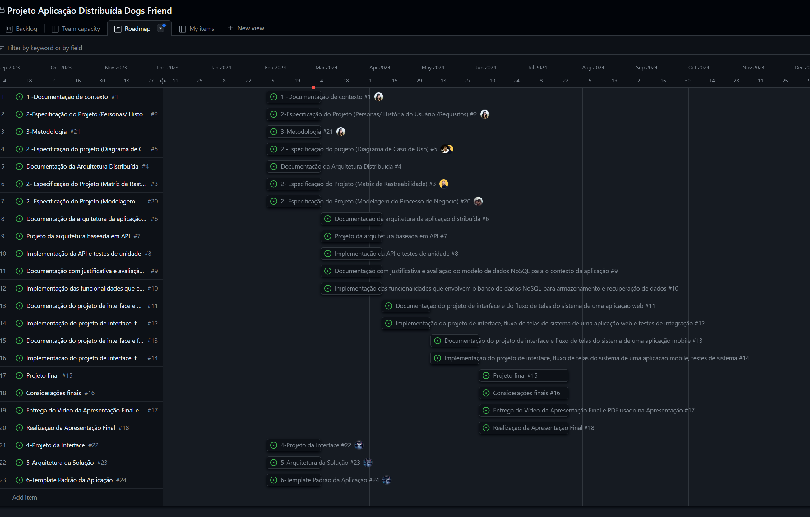

Essas ferramentas proporcionam uma gestão eficaz do tempo, permitindo que o gerente de projeto identifique possíveis atrasos, antecipe problemas e tome medidas corretivas para garantir o cumprimento dos prazos estabelecidos.

## Gerenciamento de Equipe

O gerenciamento eficiente das tarefas é essencial para garantir altos níveis de produtividade no projeto, seguindo as diretrizes da ABNT para uma documentação coesa e concisa. É fundamental que haja uma gestão eficaz das tarefas e das equipes envolvidas, facilitando o acompanhamento e a coordenação das atividades.

Uma prática adotada para gerenciar as tarefas foi a criação de um quadro de atividades no GitHub, como ilustrado na imagem abaixo:

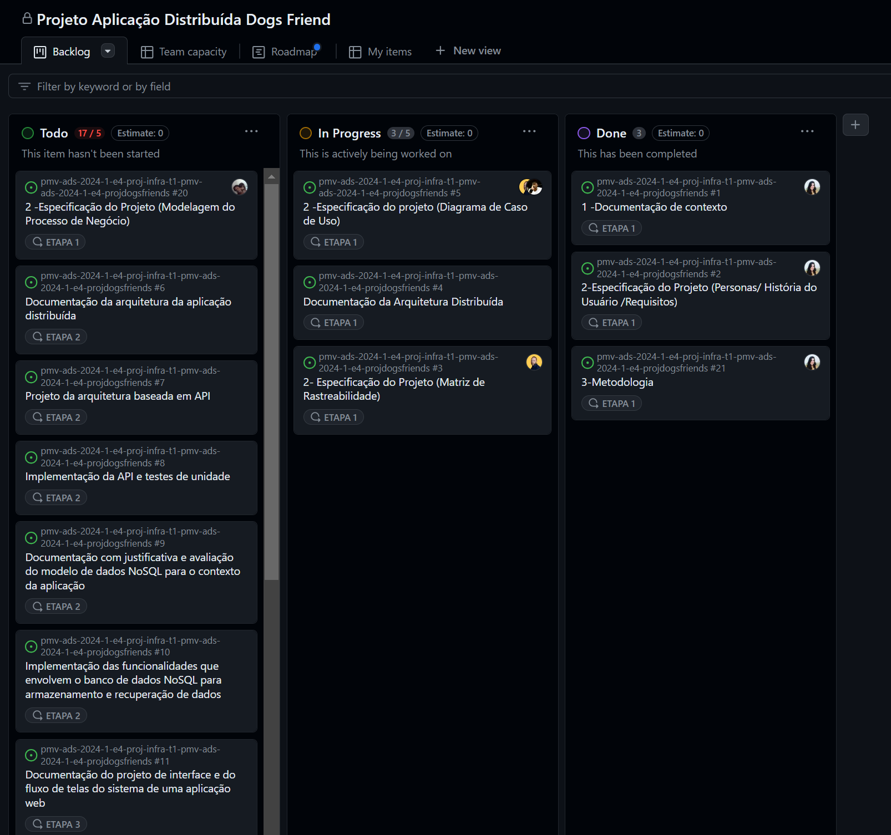

Esse quadro permite uma visualização clara das tarefas em andamento, pendentes e concluídas, proporcionando uma melhor organização e acompanhamento do progresso do projeto. Além disso, facilita a atribuição de responsabilidades e a comunicação entre os membros da equipe, contribuindo para a eficiência e o sucesso do projeto.

## Gestão de Orçamento

A determinação do orçamento do projeto é uma etapa crucial, dependendo dos resultados de processos anteriores de gerenciamento de custos, bem como de outras áreas, como escopo e tempo. A documentação segue as normas da ABNT para uma apresentação clara e concisa.

A imagem abaixo ilustra um exemplo de tabela com o tipo de despesas, custo mensal e total ao longo de cinco meses:

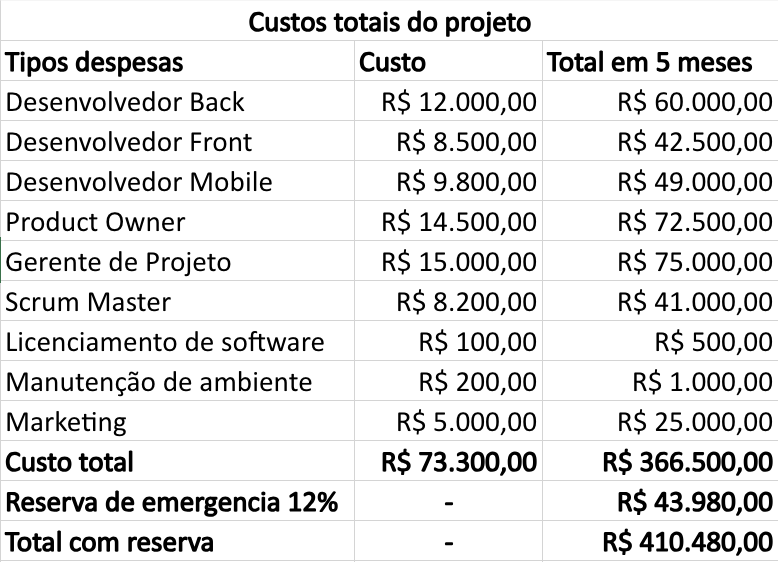

Essa tabela fornece uma visão detalhada dos custos envolvidos no projeto ao longo do tempo, permitindo um controle eficaz das despesas e garantindo que o projeto permaneça dentro do orçamento estabelecido.