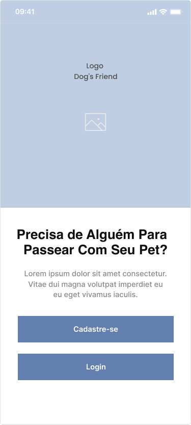
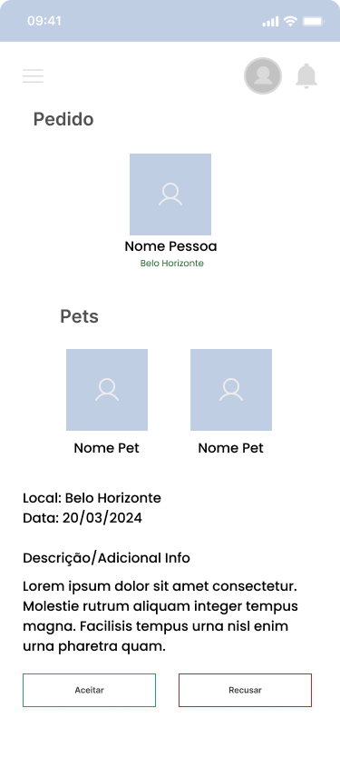
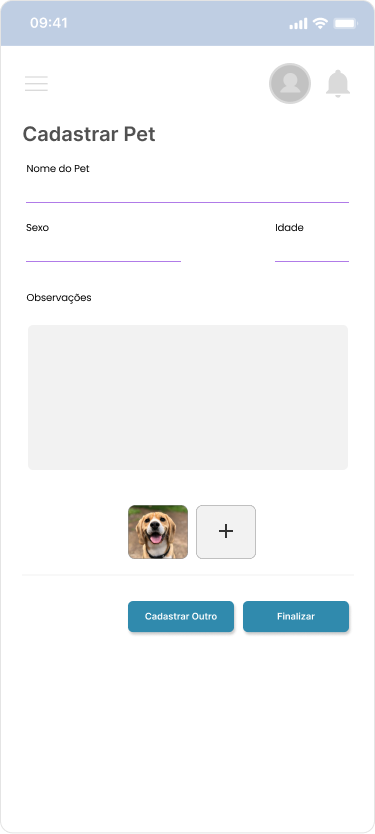
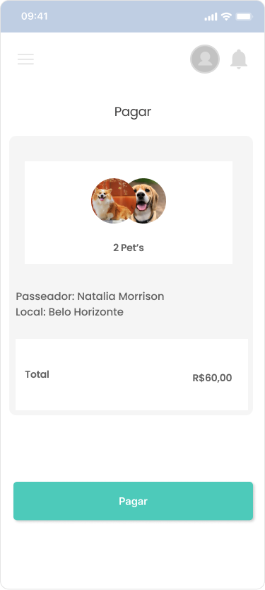

# Projeto de Interface

Visão geral da interação do usuário pelas telas do sistema e protótipo interativo das telas com as funcionalidades que fazem parte do sistema (wireframes).

Apresente as principais interfaces da plataforma. Discuta como ela foi elaborada de forma a atender os requisitos funcionais, não funcionais e histórias de usuário abordados nas <a href="2-Especificação do Projeto.md"> Documentação de Especificação</a>.

## Diagrama de Fluxo

O diagrama apresenta o estudo do fluxo de interação do usuário com o sistema interativo e muitas vezes sem a necessidade do desenho do design das telas da interface. Isso permite que o design das interações seja bem planejado e gere impacto na qualidade no design do wireframe interativo que será desenvolvido logo em seguida.

    

## Wireframes / Prototipos /App

<table >
    <tr >
       <th>Tela Inicial App</th>
       <th>Cadastro</th>
       <th>Login</th>
    </tr>
    <tr>
    <td width="300" >
       
    </td>
      <td width="300" >
        
    </td>
       <td width="300" >
       
    </td>
    </tr>
</table>
<table >
    <tr >
       <th>Dashboard</th>
       <th>Pesquisa</th>
       <th>Perfil</th>
    </tr>
    <tr>
    <td width="300" >
       
    </td>
      <td width="300" >
        
    </td>
       <td width="300" >
       
    </td>
    </tr>
</table>

 <table >
    <tr >
       <th>Notificações</th>
       <th>Pedido ao Passeador</th>
       <th>Cadastrar Pet</th>
    </tr>
    <tr>
    <td width="300" >
       
    </td>
      <td width="300" >
        
    </td>
       <td width="300" >
       
    </td>
    </tr>
</table>
 
 
 <table >
    <tr >
       <th>Pagamento</th>
       <th>Pix</th>
       <th>Sucesso</th>
    </tr>
    <tr>
    <td width="300" >
       
    </td>
      <td width="300" >
        
    </td>
       <td width="300" >
       
    </td>
    </tr>
</table>
 
