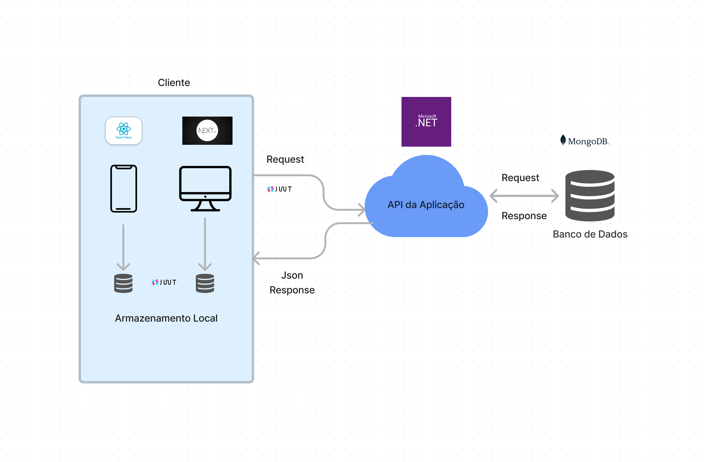
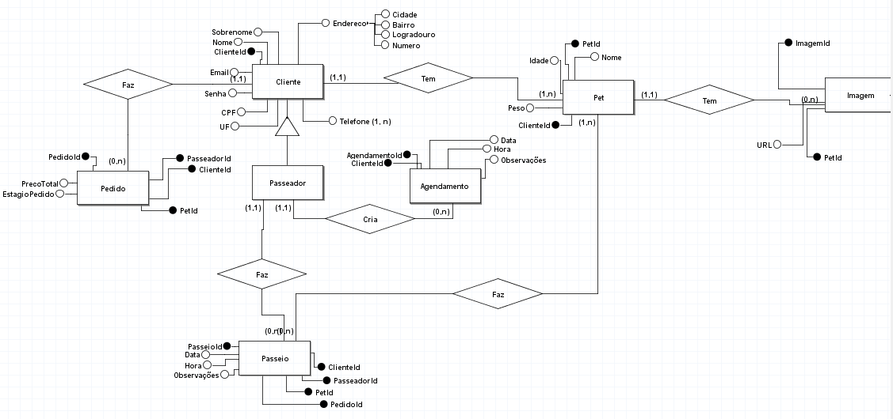
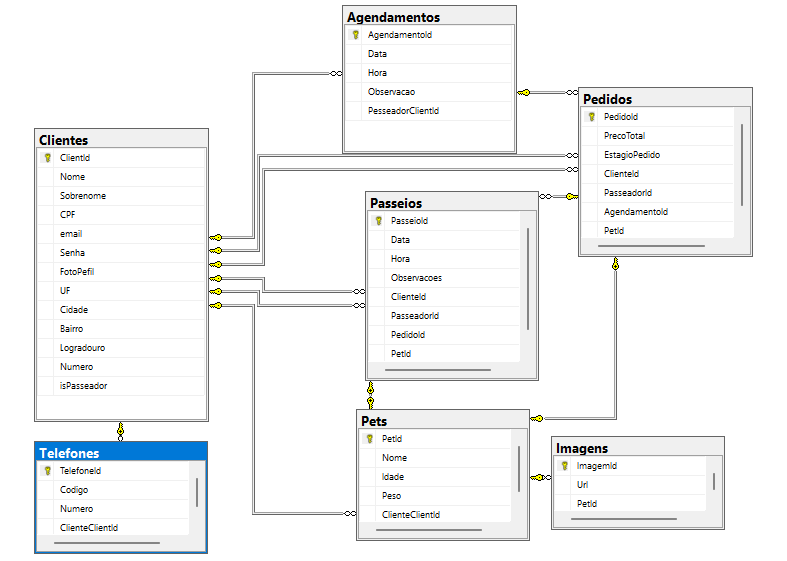

# Arquitetura da Solução

Pré-requisitos: <a href="3-Projeto de Interface.md"> Projeto de Interface</a>

Definição de como o software é estruturado em termos dos componentes que fazem parte da solução e do ambiente de hospedagem da aplicação.

        

## Diagrama de Classes

O diagrama de classes ilustra graficamente como será a estrutura do software, e como cada uma das classes da sua estrutura estarão interligadas. Essas classes servem de modelo para materializar os objetos que executarão na memória.

As referências abaixo irão auxiliá-lo na geração do artefato “Diagrama de Classes”.

> - [Diagramas de Classes](./img/diagramas/driagrama.png)

## Modelo ER  (Projeto Conceitual)

O Modelo ER representa através de um diagrama como as entidades (coisas, objetos) se relacionam entre si na aplicação interativa.

        

## Esquema Relacional

O Esquema Relacional corresponde à representação dos dados em tabelas juntamente com as restrições de integridade e chave primária.

        

## Modelo Físico

Entregar um arquivo banco.sql contendo os scripts de criação das tabelas do banco de dados. Este arquivo deverá ser incluído dentro da pasta src\bd.

## Tecnologias Utilizadas

- Node.js
- React
- React-Native
- Typescript
- CSharp
- .NET Framework
- MongoDB
- Microsoft Visual Code
- Microsoft Visual Studio
## Hospedagem

Explique como a hospedagem e o lançamento da plataforma foi feita.

## Qualidade de Software

A norma ISO/25010 define um modelo de qualidade de software que inclui oito características principais, cada uma com subcaracterísticas. A tabela abaixo apresenta essas características e subcaracterísticas:

|Característica de Qualidade	|Subcaracterísticas	|Métricas	|Pontos|
|--------------------|------------------------------------|----------------------------------------|----------------------------------------|
|Funcionalidade	|Adequação	|Número de requisitos atendidos	| |
| |Acurácia	|Número de erros de precisão	| |
| |Interoperabilidade	|Número de sistemas com os quais se comunica	||
| |Conformidade	|Número de requisitos regulamentares atendidos	| |
| |Segurança de acesso	|Número de vulnerabilidades de segurança identificadas	||
|Confiabilidade	|Maturidade	|Tempo médio entre falhas	||
| |Tolerância a falhas	|Número máximo de falhas toleráveis antes da interrupção do serviço	| |
| |Recuperabilidade	|Tempo médio de recuperação após uma falha	||
|Usabilidade	|Compreensibilidade	|Nível de escolaridade necessário para usar o sistema	||
| |Aprendizagem	|Tempo médio necessário para realizar uma tarefa pela primeira vez	||
| |Operabilidade	|Número de cliques/telas necessárias para realizar uma tarefa	||
| |Atratividade	|Número de usuários que avaliam o sistema como "atraente"	||
|Eficiência	|Comportamento em relação ao tempo	|Tempo médio de resposta do sistema	||
| |Comportamento em relação aos recursos	|Uso médio de recursos do sistema	||
|Manutenibilidade	|Analisabilidade	|Tempo médio necessário para identificar a causa de um defeito	||
| |Modificabilidade	|Tempo médio necessário para implementar uma alteração	||
| |Estabilidade	|Número de defeitos identificados após uma alteração	||
| |Testabilidade	|Número de testes necessários para validar uma alteração	||
|Portabilidade	|Adaptabilidade	|Número de plataformas para as quais o sistema é portável	||
| |Capacidade de instalação	|Tempo médio necessário para instalar o sistema	||
| |Coexistência	|Número de sistemas com os quais o sistema pode coexistir	||
| |Substituibilidade	|Tempo médio necessário para substituir o sistema	||