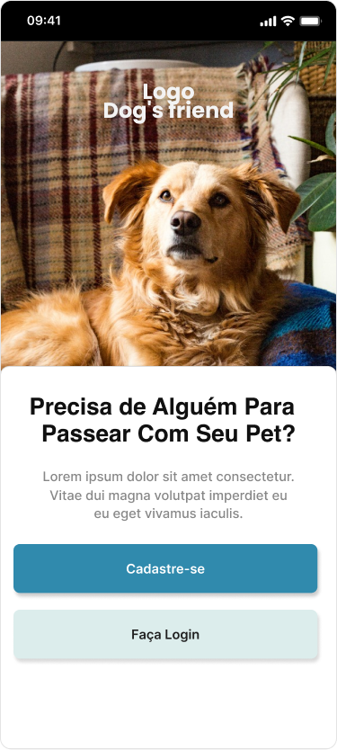
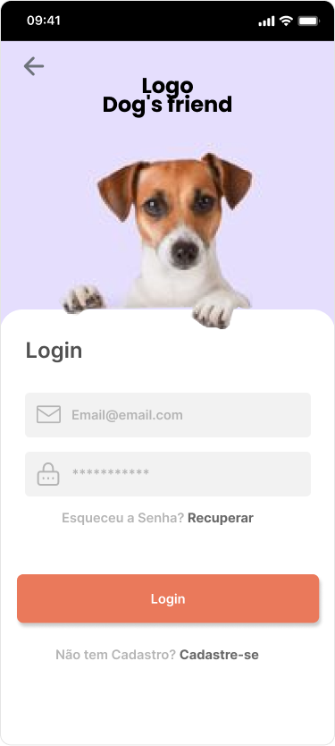
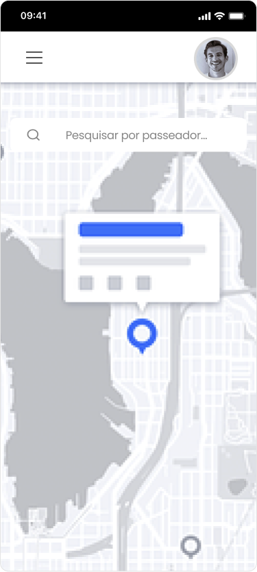

# Template Padrão da Aplicação Mobile

Pré-requisitos: <a href="2-Especificação do Projeto.md"> Especificação do Projeto</a>, <a href="3-Projeto de Interface.md"> Projeto de Interface</a>, <a href="4-Metodologia.md"> Metodologia</a>

Layout padrão da aplicação que será utilizado em todas as páginas com a definição de identidade visual, aspectos de responsividade e iconografia.

<table >
    <tr >
       <th>Tela Inicial Mobile</th>
       <th>Cadastro</th>
       <th>Login</th>
    </tr>
    <tr>
    <td width="300" style="text-align:center" >
       
    </td>
      <td width="300" style="text-align:center">
        
    </td>
       <td width="300" style="text-align:center" >
       
    </td>
    </tr>
</table>

<table >
    <tr >
       <th>Tela Perfil</th>
       <th>Mapa</th>
       <th>Login</th>
    </tr>
    <tr>
    <td width="300" style="text-align:center">
       
    </td>
      <td width="300" style="text-align:center">
        
    </td>
       <td width="300" style="text-align:center">
       
    </td>
    </tr>
</table>