# Registro de Testes de Software

### Teste da classe AuthService

<table >
    <tr >
       <th>Modulos da classe</th>
       <th>Dados mocados</th>
    </tr>
    <tr>
        <td width="350" style="text-align:center" >
        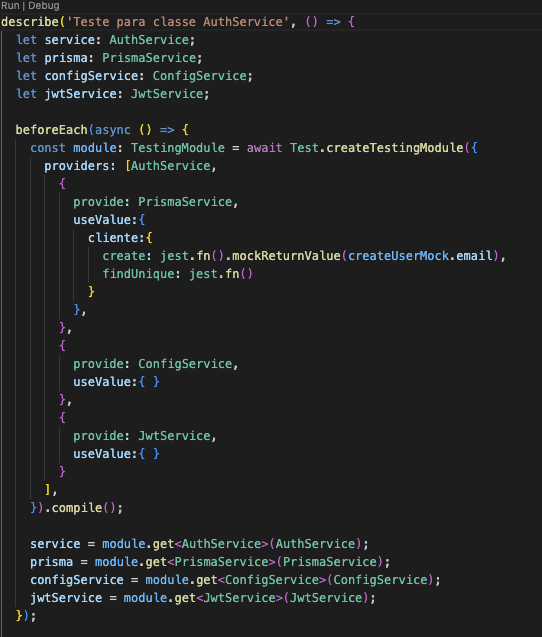
        </td>   
         <td width="350" style="text-align:center" >
        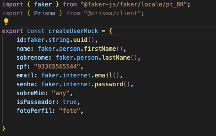
        </td>       
    </tr>
     
</table>
 
 <table >
   
 <tr >
       <th>Testa se as classes são definidas</th>
    </tr>
    <tr>
        <td width="350" style="text-align:center" >
        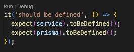
        </td>       
    </tr>
    
     
</table>
 

<table >
   
 <tr >
       <th>Testa o metodo create. Médodo para criar um usuário.</th>
    </tr>
    <tr>
        <td width="550" style="text-align:center" >
        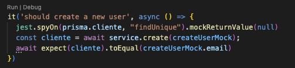
        </td>       
    </tr>
    
     
</table>

<table >
   
 <tr >
       <th>Testa o método create para email já cadastrado.</th>
    </tr>
    <tr>
        <td width="550" style="text-align:center" >
        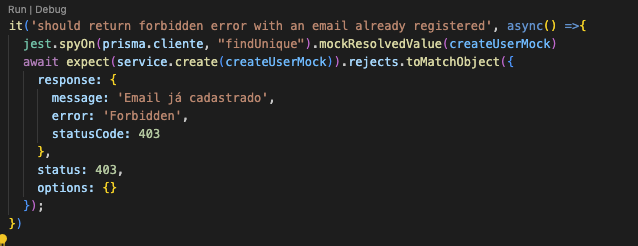
        </td>       
    </tr>
    
     
</table>

<table >
   
 <tr >
       <th>Deve retornar uma exceção quando o cadastro falhar.</th>
    </tr>
    <tr>
        <td width="550" style="text-align:center" >
        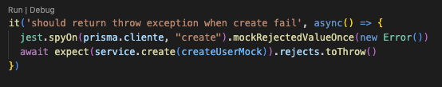
        </td>       
    </tr>
    
     
</table>

## Testes dos metodos da classe ClienteService

<table >
    <tr >
       <th>Modulos da classe</th>
       <th>Dados mocados</th>
    </tr>
    <tr>
        <td width="350" style="text-align:center" >
        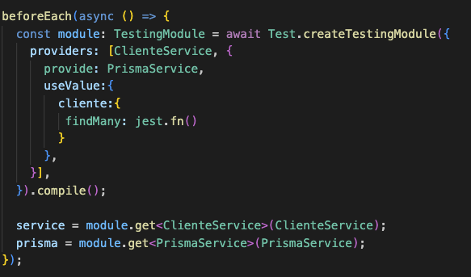
        </td>   
         <td width="350" style="text-align:center" >
        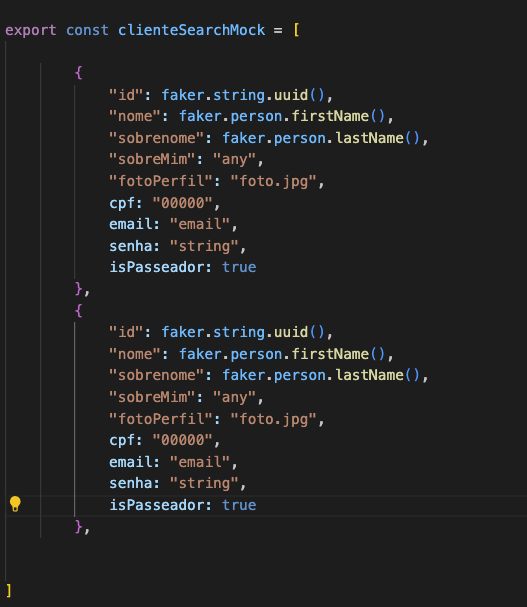
        </td>       
    </tr>
     
</table>

<table >
   
 <tr >
       <th>Teste: Deve retornar uma lista de Passeadores</th>
    </tr>
    <tr>
        <td width="550" style="text-align:center" >
        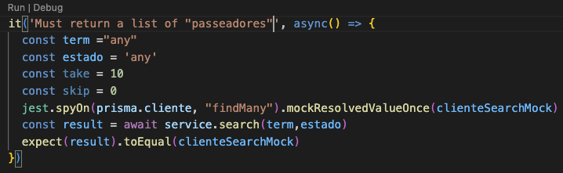
        </td>       
    </tr>
    
     
</table>

### Teste da classe PetService

<table >
    <tr >
       <th>Modulos da classe</th>
       <th>Dados mocados</th>
    </tr>
    <tr>
        <td width="350" style="text-align:center" >
        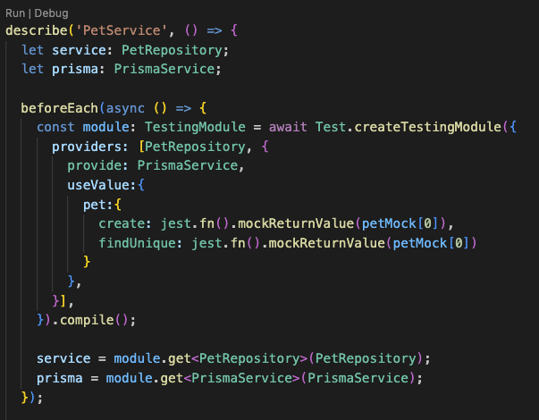
        </td>   
         <td width="350" style="text-align:center" >
        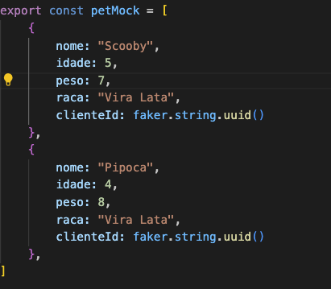
        </td>       
    </tr>
     
</table>

 <table >
   
 <tr >
       <th>Testa se é possivel criar um pet</th>
    </tr>
    <tr>
        <td width="350" style="text-align:center" >
        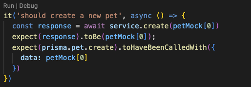
        </td>       
    </tr>
    
     
</table>

 <table >
   
 <tr >
       <th>Testa se é possivel encontrar um pet pelo id</th>
    </tr>
    <tr>
        <td width="350" style="text-align:center" >
        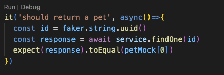
        </td>       
    </tr>
    
     
</table>

 <table >
   
 <tr >
       <th>Deve retornar Not Found, se um pet não é encontrado</th>
    </tr>
    <tr>
        <td width="550" style="text-align:center" >
        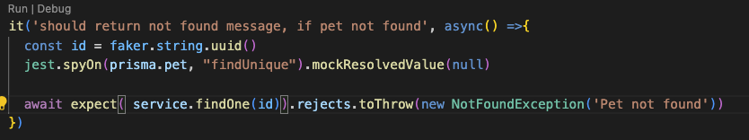
        </td>       
    </tr>
    
     
</table>
 
 
 